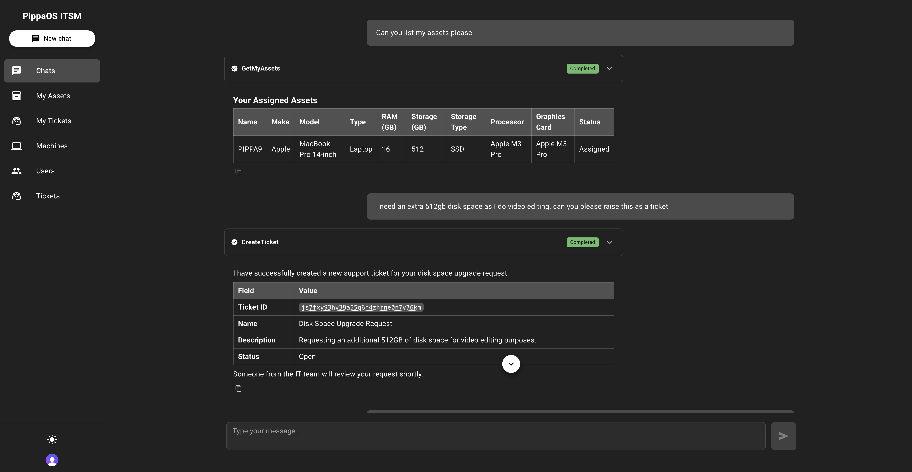
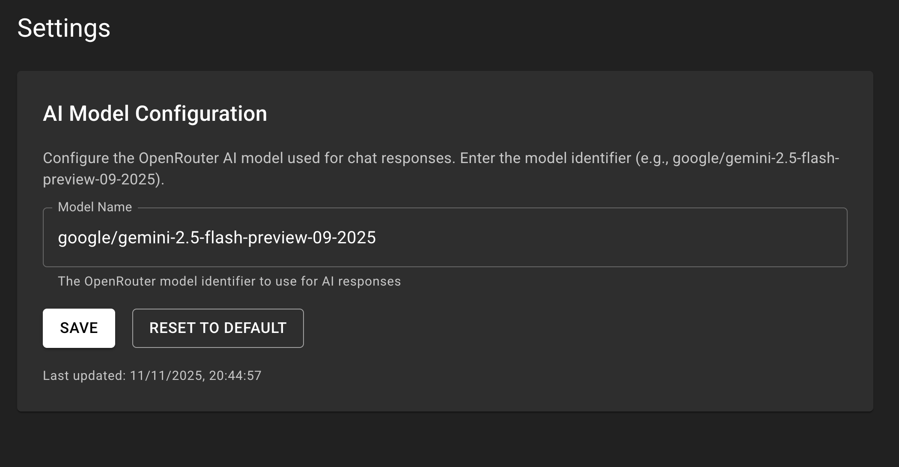
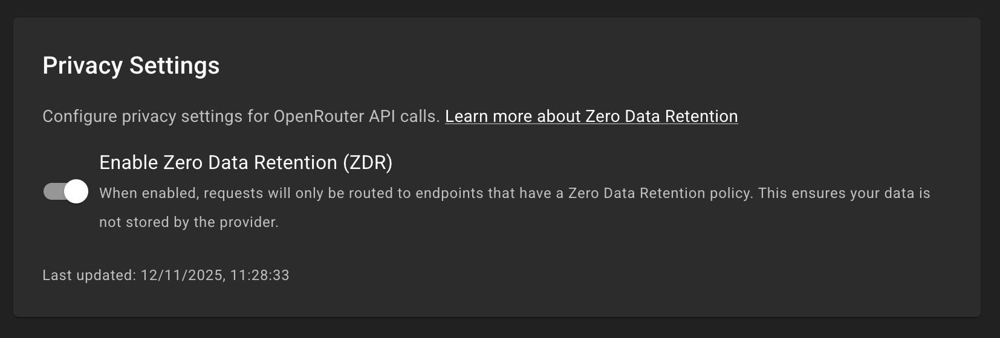

# ITSM



IT Service Management system built with Convex, React 19, and Material-UI.

Here is a demo of the app in action:

https://www.youtube.com/watch?v=6njPEsBIB_o

## Overview

This application provides IT service management functionality including asset tracking, ticket management, and an AI-powered assistant for handling common ITSM tasks. This is built fully using Cursor, mainly the Composer 1, Sonnet 4.5 and GPT-5 models. I want to see how far I can take an actual product with AI based coding. This is still a work in progress.

## Tech Stack

- Backend: Convex
- Frontend: React 19, Material-UI 7, React Router 7
- Authentication: Clerk
- AI: @convex-dev/agent with OpenRouter

## Features

- Machine asset management with hardware specifications tracking
- Support ticket creation and assignment
- User directory and management
- Notes attached to entities (machines, tickets, users)
- Custom tagging system for entity metadata
- AI chat assistant with function calling capabilities
- Multi-user authentication and authorization
- Light and dark mode support
- Entity ID detection with interactive hover tooltips

## AI Assistant Capabilities

The AI assistant can perform the following operations through function calling:

- Search machines by name, type, or specifications
- Search users by name or email
- View assigned machines for any user
- Create and update support tickets
- View tickets by status or assignment
- Add notes to machines, tickets, or users
- Retrieve notes for any entity
- Get current date/time for temporal queries

## Development Setup

### Prerequisites

- Node.js (version specified in package.json)
- npm
- Docker (for containerized deployment)
- Convex account
- Clerk account
- OpenRouter API key

### Installation

Clone the repository and install dependencies:

```bash
npm install
```

### Environment Configuration

Create a `.env.local` file in the project root:

```
VITE_CONVEX_URL=https://your-deployment.convex.cloud
VITE_CLERK_PUBLISHABLE_KEY=pk_test_...
```

### Convex Setup

Initialize and deploy Convex functions:

```bash
npx convex dev
```

Set required Convex environment variables:

```bash
npx convex env set CLERK_JWT_ISSUER_DOMAIN=your-clerk-domain.clerk.accounts.dev
npx convex env set OPENROUTER_API_KEY=your-openrouter-key
```

### Clerk Configuration

1. Create a Convex JWT template in your Clerk dashboard
2. Configure the Issuer URL in Convex auth config
3. Add the publishable key to `.env.local`

### AI Model Configuration

You must configure the AI model before using the chat assistant. After starting the application, navigate to the Settings page (`/settings`) and configure the OpenRouter AI model that will be used for chat responses. Enter the model identifier in the "Model Name" field and click "Save".



**Tested Models:**

The following OpenRouter models have been tested and work correctly:

- `anthropic/claude-haiku-4.5`
- `google/gemini-2.5-flash-preview-09-2025`

You can use any OpenRouter model identifier, but make sure to test it before using it in production.

### Privacy Settings

The application includes a Zero Data Retention (ZDR) setting that allows you to control how your data is handled by OpenRouter. When enabled, requests will only be routed to endpoints that have a Zero Data Retention policy, ensuring your data is not stored by the provider.



You can configure this setting on the Settings page (`/settings`). For more information about Zero Data Retention, see the [OpenRouter ZDR documentation](https://openrouter.ai/docs/features/zdr).

### Running the Application

#### Option 1: Local Development

Start the development server:

```bash
npm run dev
```

The application will be available at `http://localhost:5173`

#### Option 2: Docker

To run the application using Docker:

```bash
docker compose up --build -d
```

This will build and start the containerized application in detached mode. The application will be available at `http://localhost:5173`

## Database Schema

The application uses the following main tables:

- `users` - User accounts with Clerk integration
- `machines` - Hardware assets (laptops, desktops, servers)
- `tickets` - Support tickets with status tracking
- `ticketMachines` - Many-to-many relationship between tickets and machines
- `notes` - Notes attached to any entity
- `tags` - Key-value tags for entities

## License

AGPL-3.0

## Contact Me

pippachat@.pm.me
